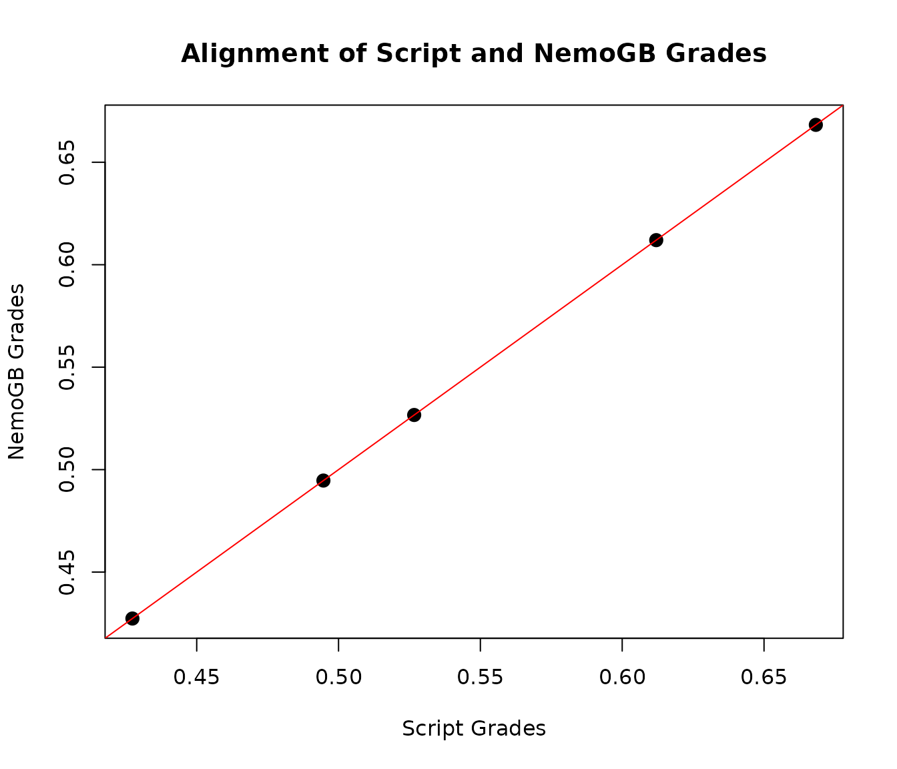

# Case Study: Complex Syllabus

Now, we will walk through a complex syllabus and its `nemogb`
implementation with 5 students in the class. Start with what this
syllabus would look like on a class website.

## Syllabus

The final student’s grade is computed from *1) labs, 2) midterm exam and
3) final exam*. Their grade will be computed as follows:

- Labs 20%
  - Lab 1, Lab 2, and Lab 3
  - They are aggregated equally
  - Each “Lab \#” is compiled of two parts, which are weighted by their
    respective point value: “Lab \#.1” & “Lab \#.2”
    - For example: if Lab 1.1 is worth 15 points and Lab 1.2 is worth 5
      points, then Lab 1.1 accounts for 75% of Lab 1 score.
  - The lowest 1 assignment is dropped
  - All components of the lab individually experience a lateness
    penalty:
    - 10% reduction of the score, if assignment is submitted late but
      within 24 hours of the deadline
    - 30% reduction of the score, if assignment is submitted after 24
      hours of the deadline deadline
- Midterm 40%
- Final Exam 40%

## Policy File

Here is what the policy file looks like:

``` yaml
coursewide:
  course: Stat 101 Complex Syllabus
  description: This is the description for a course with a complex syllabus

categories:
  - category: Overall Grade
    aggregation: weighted_mean
    assignments:
    - category: Labs
      weight: 0.40
      drop_n_lowest: 1
      aggregation: equally_weighted
      assignments:
      - category: Lab 1
        lateness:
        - between:
           from: '00:00:01'
           to: '24:00:00'
        - scale_by: 0.9
        - after: '24:00:01'
        - scale_by: 0.7
        aggregation: weighted_by_points
        assignments:
        - "Lab 1.1"
        - "Lab 1.2"
      - category: Lab 2
        lateness:
        - between:
           from: '00:00:01'
           to: '24:00:00'
        - scale_by: 0.9
        - after: '24:00:01'
        - scale_by: 0.7
        aggregation: weighted_by_points
        assignments:
        - "Lab 2.1"
        - "Lab 2.2"
      - category: Lab 3
        lateness:
        - between:
           from: '00:00:01'
           to: '24:00:00'
        - scale_by: 0.9
        - after: '24:00:01'
        - scale_by: 0.7
        aggregation: weighted_by_points
        assignments:
        - "Lab 3.1"
        - "Lab 3.2"
    - category: Midterm
      weight: 0.20
      aggregation: none
      assignments:
      - "Midterm Exam"
    - category: Final
      weight: 0.40
      aggregation: none
      assignments:
      - "Final Exam"
```

## Gradescope Assigments File

Here is what the gradescope assignments file looks like:

``` r
complex_syllabus_data <- read_gs(system.file("extdata", "complex_syllabus_data.csv", package = "nemogb"))
```

| Names         | Email                     |        SID | Sections  | Lab 1.1 | Lab 1.1 - Max Points | Lab 1.1 - Submission Time | Lab 1.1 - Lateness (H:M:S) | Lab 1.2 | Lab 1.2 - Max Points | Lab 1.2 - Submission Time | Lab 1.2 - Lateness (H:M:S) | Lab 2.1 | Lab 2.1 - Max Points | Lab 2.1 - Submission Time | Lab 2.1 - Lateness (H:M:S) | Lab 2.2 | Lab 2.2 - Max Points | Lab 2.2 - Submission Time | Lab 2.2 - Lateness (H:M:S) | Lab 3.1 | Lab 3.1 - Max Points | Lab 3.1 - Submission Time | Lab 3.1 - Lateness (H:M:S) | Lab 3.2 | Lab 3.2 - Max Points | Lab 3.2 - Submission Time | Lab 3.2 - Lateness (H:M:S) | Midterm Exam | Midterm Exam - Max Points | Midterm Exam - Submission Time | Midterm Exam - Lateness (H:M:S) | Final Exam | Final Exam - Max Points | Final Exam - Submission Time | Final Exam - Lateness (H:M:S) |
|:--------------|:--------------------------|-----------:|:----------|--------:|---------------------:|:--------------------------|:---------------------------|--------:|---------------------:|:--------------------------|:---------------------------|--------:|---------------------:|:--------------------------|:---------------------------|--------:|---------------------:|:--------------------------|:---------------------------|--------:|---------------------:|:--------------------------|:---------------------------|--------:|---------------------:|:--------------------------|:---------------------------|-------------:|--------------------------:|:-------------------------------|:--------------------------------|-----------:|------------------------:|:-----------------------------|:------------------------------|
| Alice Smith   | <alice.smith@email.com>   | 3032412514 | section-1 |       9 |                   10 | 1/19/23 22:20             | 00:00:00                   |       5 |                   20 | 9/21/22 23:54             | 47:55:53                   |       7 |                   15 | 1/24/23 20:38             | 00:00:00                   |       9 |                   10 | 1/26/23 19:51             | 00:00:00                   |       0 |                    5 | 1/31/23 18:59             | 00:00:00                   |       4 |                   10 | 2/2/23 12:16              | 00:00:00                   |           44 |                        50 | 2/14/23 21:06                  | 00:00:00                        |         10 |                     100 | 1/20/23 15:13                | 00:00:00                      |
| Bob Johnson   | <bob.johnson@email.com>   | 3032412515 | section-1 |       5 |                   10 | 1/19/23 12:16             | 00:00:00                   |      20 |                   20 | 9/19/22 23:32             | 00:00:00                   |       1 |                   15 | 1/24/23 16:18             | 00:00:00                   |       5 |                   10 | 1/26/23 8:54              | 00:00:00                   |       1 |                    5 | 1/31/23 13:04             | 00:00:00                   |       0 |                   10 | 2/2/23 12:12              | 00:00:00                   |            0 |                        50 | 2/14/23 18:25                  | 00:00:00                        |         78 |                     100 | 1/20/23 10:04                | 00:00:00                      |
| Charlie Brown | <charlie.brown@email.com> | 3032412516 | section-1 |      10 |                   10 | 1/19/23 10:26             | 00:00:00                   |      12 |                   20 | 9/19/22 23:44             | 00:00:00                   |      15 |                   15 | 1/24/23 16:10             | 00:00:00                   |       8 |                   10 | 1/26/23 10:12             | 00:00:00                   |       3 |                    5 | 1/31/23 16:01             | 00:00:00                   |       6 |                   10 | 2/2/23 10:13              | 00:00:00                   |           17 |                        50 | 2/14/23 18:00                  | 00:00:00                        |         24 |                     100 | 1/23/23 8:22                 | 00:00:00                      |
| David Wilson  | <david.wilson@email.com>  | 3032412517 | section-1 |      10 |                   10 | 1/20/23 8:12              | 00:00:00                   |       1 |                   20 | 9/13/22 20:29             | 00:00:00                   |       8 |                   15 | 1/25/23 8:56              | 08:57:32                   |       6 |                   10 | 1/26/23 17:27             | 00:00:00                   |       1 |                    5 | 1/31/23 14:57             | 00:00:00                   |      10 |                   10 | 2/2/23 16:43              | 00:00:00                   |           15 |                        50 | 2/14/23 20:00                  | 00:00:00                        |         89 |                     100 | 1/24/23 0:50                 | 00:00:00                      |
| Eva White     | <eva.white@email.com>     | 3032412518 | section-1 |       8 |                   10 | 1/19/23 12:06             | 00:00:00                   |      10 |                   20 | 9/19/22 0:15              | 00:00:00                   |       9 |                   15 | 1/25/23 14:58             | 14:59:55                   |       1 |                   10 | 1/27/23 14:09             | 14:10:40                   |       4 |                    5 | 1/31/23 15:44             | 00:00:00                   |       0 |                   10 | 2/2/23 22:27              | 00:00:00                   |            8 |                        50 | 2/15/23 13:51                  | 00:52:01                        |         97 |                     100 | 1/20/23 15:53                | 00:00:00                      |

## Workflow

**Overall grade** is calculated using the three categories, with the
weights as shown above; This is represented by `Overall Grade` with an
aggregation of `weighted_mean`.

The **Midterm** and **Final Exam** categories contain only a single
assignment, as shown in the `complex_syllabus_data` file, which is
usually downloaded from gradescope.

The **Labs** category is compiled of **3 nested categories**: *“Lab 1”*,
*“Lab 2”*, *“Lab 3”*, and each has 2 corresponding assignments: *“Lab
1.1”*, *“Lab 1.2”*, *“Lab 2.1”*, *“Lab 2.2”*, *“Lab 3.1”*, *“Lab 3.2”*.

### Grade Calculations

``` r
complex_syllabus_data <- read_gs(system.file("extdata", "complex_syllabus_data.csv", package = "nemogb"))

policy <- read_policy(system.file("extdata", "complex_syllabus.yaml", package = "nemogb"))

grades <- get_grades(policy = policy, gs = complex_syllabus_data)
```

First, read in your YAML policy file.
[`process_policy()`](https://github.com/nemogb-dev/nemogb-r/reference/process_policy.md)
checks the formatting of the policy file.
Then,[`reconcile_policy_with_gs()`](https://github.com/nemogb-dev/nemogb-r/reference/reconcile_policy_with_gs.md)
checks for compatibility between the Gradescope file
(`complex_syllabus_data`) and the policy file (`policy`). Finally,
[`get_grades()`](https://github.com/nemogb-dev/nemogb-r/reference/get_grades.md)
grades your assignments based on your policy file.

The output of the grades looks like:

| Names         | Email                     | SID        | Sections  | Lab 1.1 | Lab 1.1 - Max Points | Lab 1.1 - Submission Time | Lab 1.1 - Lateness (H:M:S) | Lab 1.2 | Lab 1.2 - Max Points | Lab 1.2 - Submission Time | Lab 1.2 - Lateness (H:M:S) |   Lab 2.1 | Lab 2.1 - Max Points | Lab 2.1 - Submission Time | Lab 2.1 - Lateness (H:M:S) | Lab 2.2 | Lab 2.2 - Max Points | Lab 2.2 - Submission Time | Lab 2.2 - Lateness (H:M:S) | Lab 3.1 | Lab 3.1 - Max Points | Lab 3.1 - Submission Time | Lab 3.1 - Lateness (H:M:S) | Lab 3.2 | Lab 3.2 - Max Points | Lab 3.2 - Submission Time | Lab 3.2 - Lateness (H:M:S) | Midterm Exam | Midterm Exam - Max Points | Midterm Exam - Submission Time | Midterm Exam - Lateness (H:M:S) | Final Exam | Final Exam - Max Points | Final Exam - Submission Time | Final Exam - Lateness (H:M:S) |     Lab 1 | Lab 1 - Max Points | Lab 1 - Lateness (H:M:S) | Lab 2 | Lab 2 - Max Points | Lab 2 - Lateness (H:M:S) |     Lab 3 | Lab 3 - Max Points | Lab 3 - Lateness (H:M:S) |      Labs | Labs - Max Points | Labs - Lateness (H:M:S) | Midterm | Midterm - Max Points | Midterm - Lateness (H:M:S) | Final | Final - Max Points | Final - Lateness (H:M:S) | Overall Grade | Overall Grade - Max Points | Overall Grade - Lateness (H:M:S) |
|:--------------|:--------------------------|:-----------|:----------|--------:|---------------------:|--------------------------:|:---------------------------|--------:|---------------------:|--------------------------:|:---------------------------|----------:|---------------------:|--------------------------:|:---------------------------|--------:|---------------------:|--------------------------:|:---------------------------|--------:|---------------------:|--------------------------:|:---------------------------|--------:|---------------------:|--------------------------:|:---------------------------|-------------:|--------------------------:|-------------------------------:|:--------------------------------|-----------:|------------------------:|-----------------------------:|:------------------------------|----------:|-------------------:|:-------------------------|------:|-------------------:|:-------------------------|----------:|-------------------:|:-------------------------|----------:|------------------:|:------------------------|--------:|---------------------:|:---------------------------|------:|-------------------:|:-------------------------|--------------:|---------------------------:|:---------------------------------|
| Alice Smith   | <alice.smith@email.com>   | 3032412514 | section-1 |     0.9 |                   10 |                         4 | 00:00:00                   |   0.175 |                   20 |                         5 | 47:55:53                   | 0.4666667 |                   15 |                         3 | 00:00:00                   |    0.90 |                   10 |                         3 | 00:00:00                   |     0.0 |                    5 |                         5 | 00:00:00                   |     0.4 |                   10 |                         3 | 00:00:00                   |         0.88 |                        50 |                              4 | 00:00:00                        |       0.10 |                     100 |                            2 | 00:00:00                      | 0.4166667 |                 30 | 47:55:53                 | 0.640 |                 25 | 00:00:00                 |        NA |                 NA | 00:00:00                 | 0.5283333 |                55 | 47:55:53                |    0.88 |                   50 | 00:00:00                   |  0.10 |                100 | 00:00:00                 |     0.4273333 |                        205 | 47:55:53                         |
| Bob Johnson   | <bob.johnson@email.com>   | 3032412515 | section-1 |     0.5 |                   10 |                         3 | 00:00:00                   |   1.000 |                   20 |                         3 | 00:00:00                   | 0.0666667 |                   15 |                         2 | 00:00:00                   |    0.50 |                   10 |                         4 | 00:00:00                   |     0.2 |                    5 |                         1 | 00:00:00                   |     0.0 |                   10 |                         2 | 00:00:00                   |         0.00 |                        50 |                              2 | 00:00:00                        |       0.78 |                     100 |                            1 | 00:00:00                      | 0.8333333 |                 30 | 00:00:00                 | 0.240 |                 25 | 00:00:00                 |        NA |                 NA | 00:00:00                 | 0.5366667 |                55 | 00:00:00                |    0.00 |                   50 | 00:00:00                   |  0.78 |                100 | 00:00:00                 |     0.5266667 |                        205 | 00:00:00                         |
| Charlie Brown | <charlie.brown@email.com> | 3032412516 | section-1 |     1.0 |                   10 |                         1 | 00:00:00                   |   0.600 |                   20 |                         4 | 00:00:00                   | 1.0000000 |                   15 |                         1 | 00:00:00                   |    0.80 |                   10 |                         1 | 00:00:00                   |     0.6 |                    5 |                         4 | 00:00:00                   |     0.6 |                   10 |                         1 | 00:00:00                   |         0.34 |                        50 |                              1 | 00:00:00                        |       0.24 |                     100 |                            4 | 00:00:00                      | 0.7333333 |                 30 | 00:00:00                 | 0.920 |                 25 | 00:00:00                 |        NA |                 NA | 00:00:00                 | 0.8266667 |                55 | 00:00:00                |    0.34 |                   50 | 00:00:00                   |  0.24 |                100 | 00:00:00                 |     0.4946667 |                        205 | 00:00:00                         |
| David Wilson  | <david.wilson@email.com>  | 3032412517 | section-1 |     1.0 |                   10 |                         5 | 00:00:00                   |   0.050 |                   20 |                         1 | 00:00:00                   | 0.4800000 |                   15 |                         5 | 08:57:32                   |    0.60 |                   10 |                         2 | 00:00:00                   |     0.2 |                    5 |                         2 | 00:00:00                   |     1.0 |                   10 |                         4 | 00:00:00                   |         0.30 |                        50 |                              3 | 00:00:00                        |       0.89 |                     100 |                            5 | 00:00:00                      |        NA |                 NA | 00:00:00                 | 0.528 |                 25 | 08:57:32                 | 0.7333333 |                 15 | 00:00:00                 | 0.6306667 |                40 | 08:57:32                |    0.30 |                   50 | 00:00:00                   |  0.89 |                100 | 00:00:00                 |     0.6682667 |                        190 | 08:57:32                         |
| Eva White     | <eva.white@email.com>     | 3032412518 | section-1 |     0.8 |                   10 |                         2 | 00:00:00                   |   0.500 |                   20 |                         2 | 00:00:00                   | 0.5400000 |                   15 |                         4 | 14:59:55                   |    0.09 |                   10 |                         5 | 14:10:40                   |     0.8 |                    5 |                         3 | 00:00:00                   |     0.0 |                   10 |                         5 | 00:00:00                   |         0.16 |                        50 |                              5 | 00:52:01                        |       0.97 |                     100 |                            3 | 00:00:00                      | 0.6000000 |                 30 | 00:00:00                 | 0.360 |                 25 | 14:59:55                 |        NA |                 NA | 00:00:00                 | 0.4800000 |                55 | 14:59:55                |    0.16 |                   50 | 00:52:01                   |  0.97 |                100 | 00:00:00                 |     0.6120000 |                        205 | 14:59:55                         |

Note that setting the `append = TRUE` in the
[`get_grades()`](https://github.com/nemogb-dev/nemogb-r/reference/get_grades.md)
function will output a data frame of the ID columns and the newly
calculated scores (excluding the original assignment columns from
Gradescope).

``` r
new_cat_grades <- get_grades(gs = complex_syllabus_data, 
                     policy = policy,
                     append = FALSE)
```

The output of the grades will then look like this:

| Names         | Email                     | SID        | Sections  |     Lab 1 | Lab 1 - Max Points | Lab 1 - Lateness (H:M:S) | Lab 2 | Lab 2 - Max Points | Lab 2 - Lateness (H:M:S) |     Lab 3 | Lab 3 - Max Points | Lab 3 - Lateness (H:M:S) |      Labs | Labs - Max Points | Labs - Lateness (H:M:S) | Midterm | Midterm - Max Points | Midterm - Lateness (H:M:S) | Final | Final - Max Points | Final - Lateness (H:M:S) | Overall Grade | Overall Grade - Max Points | Overall Grade - Lateness (H:M:S) |
|:--------------|:--------------------------|:-----------|:----------|----------:|-------------------:|:-------------------------|------:|-------------------:|:-------------------------|----------:|-------------------:|:-------------------------|----------:|------------------:|:------------------------|--------:|---------------------:|:---------------------------|------:|-------------------:|:-------------------------|--------------:|---------------------------:|:---------------------------------|
| Alice Smith   | <alice.smith@email.com>   | 3032412514 | section-1 | 0.4166667 |                 30 | 47:55:53                 | 0.640 |                 25 | 00:00:00                 |        NA |                 NA | 00:00:00                 | 0.5283333 |                55 | 47:55:53                |    0.88 |                   50 | 00:00:00                   |  0.10 |                100 | 00:00:00                 |     0.4273333 |                        205 | 47:55:53                         |
| Bob Johnson   | <bob.johnson@email.com>   | 3032412515 | section-1 | 0.8333333 |                 30 | 00:00:00                 | 0.240 |                 25 | 00:00:00                 |        NA |                 NA | 00:00:00                 | 0.5366667 |                55 | 00:00:00                |    0.00 |                   50 | 00:00:00                   |  0.78 |                100 | 00:00:00                 |     0.5266667 |                        205 | 00:00:00                         |
| Charlie Brown | <charlie.brown@email.com> | 3032412516 | section-1 | 0.7333333 |                 30 | 00:00:00                 | 0.920 |                 25 | 00:00:00                 |        NA |                 NA | 00:00:00                 | 0.8266667 |                55 | 00:00:00                |    0.34 |                   50 | 00:00:00                   |  0.24 |                100 | 00:00:00                 |     0.4946667 |                        205 | 00:00:00                         |
| David Wilson  | <david.wilson@email.com>  | 3032412517 | section-1 |        NA |                 NA | 00:00:00                 | 0.528 |                 25 | 08:57:32                 | 0.7333333 |                 15 | 00:00:00                 | 0.6306667 |                40 | 08:57:32                |    0.30 |                   50 | 00:00:00                   |  0.89 |                100 | 00:00:00                 |     0.6682667 |                        190 | 08:57:32                         |
| Eva White     | <eva.white@email.com>     | 3032412518 | section-1 | 0.6000000 |                 30 | 00:00:00                 | 0.360 |                 25 | 14:59:55                 |        NA |                 NA | 00:00:00                 | 0.4800000 |                55 | 14:59:55                |    0.16 |                   50 | 00:52:01                   |  0.97 |                100 | 00:00:00                 |     0.6120000 |                        205 | 14:59:55                         |

## Syllabus as a Grading Script

Here is the coded version of the same syllabus.

``` r
# function to convert HH:MM:SS into minutes
convert_to_min <- function(hms) {
  purrr::map_vec(hms, function(time) {
    units <- stringr::str_split(time, pattern = ":") |>
      unlist() |>
      as.numeric()
    sum(units * c(60, 1, 1 / 60))
  })
}

# function to implement lateness policy
lateness_penalty <- function(score_vec, lateness_vec) {
  lateness <- convert_to_min(lateness_vec)
  dplyr::case_when(
    lateness == 0 ~ score_vec,
    lateness <= 1440 ~ 0.9 * score_vec,
    .default = 0.7 * score_vec
  )
}

# function to drop lowest two grades
one_drop <- function(data) {
  apply(dplyr::select(data, `Lab 1`, `Lab 2`, `Lab 3`), 1, function(x) sort(x, decreasing = TRUE)[1:2]) |> t()
}

lab_grades_with_lateness <- complex_syllabus_data |>
  # calculate percentages
  dplyr::mutate(
    `Lab 1.1` = `Lab 1.1` / `Lab 1.1 - Max Points`,
    `Lab 1.2` = `Lab 1.2` / `Lab 1.2 - Max Points`,
    `Lab 2.1` = `Lab 2.1` / `Lab 2.1 - Max Points`,
    `Lab 2.2` = `Lab 2.2` / `Lab 2.2 - Max Points`,
    `Lab 3.1` = `Lab 3.1` / `Lab 3.1 - Max Points`,
    `Lab 3.2` = `Lab 3.2` / `Lab 3.2 - Max Points`,
    `Midterm Exam` = `Midterm Exam` / `Midterm Exam - Max Points`,
    `Final Exam` = `Final Exam` / `Final Exam - Max Points`
  ) |>
  # lateness
  dplyr::mutate(
    `Lab 1.1` = lateness_penalty(`Lab 1.1`, `Lab 1.1 - Lateness (H:M:S)`),
    `Lab 1.2` = lateness_penalty(`Lab 1.2`, `Lab 1.2 - Lateness (H:M:S)`),
    `Lab 2.1` = lateness_penalty(`Lab 2.1`, `Lab 2.1 - Lateness (H:M:S)`),
    `Lab 2.2` = lateness_penalty(`Lab 2.2`, `Lab 2.2 - Lateness (H:M:S)`),
    `Lab 3.1` = lateness_penalty(`Lab 3.1`, `Lab 3.1 - Lateness (H:M:S)`),
    `Lab 3.2` = lateness_penalty(`Lab 3.2`, `Lab 3.2 - Lateness (H:M:S)`)
  ) |>
  # calculate Lab 1, Lab 2, Lab 3 category grades
  dplyr::mutate(
    `Lab 1` = (`Lab 1.1` * `Lab 1.1 - Max Points` + `Lab 1.2` * `Lab 1.2 - Max Points`) / (`Lab 1.1 - Max Points` + `Lab 1.2 - Max Points`),
    `Lab 2` = (`Lab 2.1` * `Lab 2.1 - Max Points` + `Lab 2.2` * `Lab 2.2 - Max Points`) / (`Lab 2.1 - Max Points` + `Lab 2.2 - Max Points`),
    `Lab 3` = (`Lab 3.1` * `Lab 3.1 - Max Points` + `Lab 3.2` * `Lab 3.2 - Max Points`) / (`Lab 3.1 - Max Points` + `Lab 3.2 - Max Points`)
  )
script_grades <- lab_grades_with_lateness |>
  # calculate category grade for "Homework"
  dplyr::mutate(
    `Labs` = rowMeans(one_drop(lab_grades_with_lateness))
  ) |>
  # calculate final Overall Grade
  dplyr::mutate(`Overall Grade` = 0.4 * `Labs` + 0.2 * `Midterm Exam` + 0.4 * `Final Exam`)
```

And, as you can see, the computations align.


Disclaimers:

- The `weight` of a category with aggregation `weighted_mean` should be
  corresponding order with the `assignments.`

- Categories cannot have the same name as any other assignment name.
