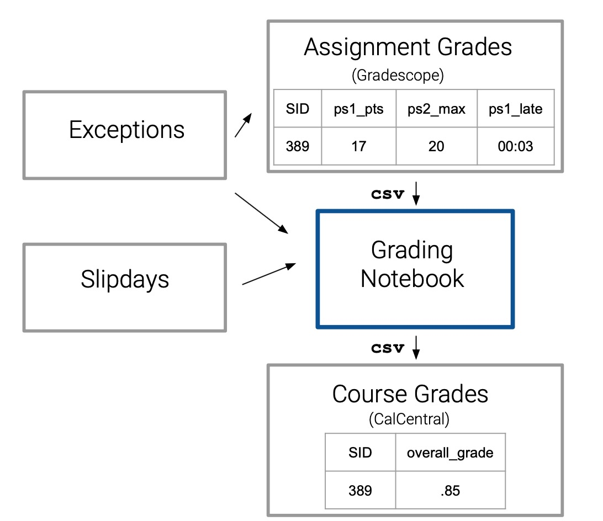

# Summary

`NemoGB` [@NemoGB-Package] allows for accurate and systematic computations of the final course letter grades. These computations require two inputs: a specifically structured YAML file representing the grading policy from the class syllabus and the assignment grades in CSV (comma-separated value) format from Gradescope [@10.1145/3051457.3051466] or other similar learning management systems, like Canvas [@canvas_gradebook_guide]. 
The package uses these two inputs to break down any complex syllabi into methodical computations that can be documented and tested.

# Statement of Need

While the final grade at the end of a course is an elementary part of most college courses, the computations for these grades quickly become deceptively intricate, especially with larger STEM classes that use various complexities to accommodate a diverse student body. Even though most classes use slight variations of the same policies, many learning management systems (LMS) cannot sustain these complex computations. In response, instructors may turn to hard-coded scripts. These scripts can quickly accumulate hundreds of lines of code, and there is no clear method to assess accuracy of the final computation. 

`NemoGB` is an R package that maintains the structure and complexity of a course grade while guaranteeing accuracy through comprehensive unit-testing. The challenges of consistency and precision in grading systems are addressed by applying the practices of data analysis and the principles of software development. The rigorous unit-testing in the package minimizes computational error and reduces the manual inputs, significantly lowering the risks of typographic and logical errors in scripts. Because of this, course grades can be computed accurately and quickly: the accuracy allows course instructors to have reliable grade computations, and the speed allows them to compute grades throughout the semester in order to monitor student progress. The structure of the package -- and the open-source nature of it -- allows for instructors to contribute functionality that is unique to their course. This R package also functions as the backend of the NemoGB Shiny app [@NemoGB-App], which lets the user create their grading policy file in a straightforward way. 

Grading Workflow WITH NemoGB             |  Grading Workflow WITHOUT NemoGB
:-------------------------:|:-------------------------:
{height="150pt"}  |  {height="150pt"}

# Story of the Project

As students, we understand the importance of having an informed instructor who understands how we stand in their course. This began as an independent study centered around using R Shiny in order to create a web-based grading tool that allowed for the computation of course grades for diverse course and assessment structures. We wanted to develop a tool that allowed for flexibility in course structure and precision in computations. This led to the development of this package, which operates as the backend of the NemoGB app but can also be used independently to compute course grades. 

# Underlying Principle

`NemoGB` breaks down the calculation of a course grade into a series of nested aggregations. It accommodates the generic policies included in most syllabi: applying lateness penalties, dropping the *n* lowest scores in a category, and using averages or weighted averages to aggregate assignment scores into overarching category scores. As previously mentioned, the structure of this package also allows for outside contribution of unique policies in order for any course structure to be computed with this package.

The details of the course grading structure -- usually detailed in the syllabus or on the class website -- can be articulated in YAML format using a series of accepted keys (e.g. `score`, `aggregation`, `lateness`, `drop_n_lowest`, etc.). More direction about creating a policy file is provided in the `Building a Policy File` vignette. The nested structure of this policy file reflects the nested structure of the course grade. The assignment scores come directly from Gradescope or other LMS in a .csv file. These two files (the YAML policy file and the LMS grade data) function as the two inputs for `NemoGB`'s primary and overarching function: `get_grades()`. After reading in the assignment data from the LMS using `read_gs()`and reading in the YAML policy file (that reflects grading policies from the syllabus) using `read_policy()`, this singular function computes the entirety of the final course grade computation.

While `get_grades()` encapsulates the entire computational functionality of the R package, it is comprised of four sequential functions:

-   `process_gs()` ensures the correct format of the .csv file from Gradescope or another LMS.

-   `process_policy()` similarly ensures the correct format of the policy file.

-   `reconcile_policy_with_gs()` checks the compatibility of the policy file and .csv file.

-   `calculate_grades()` computes the course grades and returns the final grade (and the scores for every intermediate category) appended to the original data.

# Comparison to Other Packages

Most other commonly-used packages -- particularly for R packages -- are used for
grading on an assignment-level basis. For example, the `gradeR` package "helps
grade your students’s assignment submissions that are R Scripts" [@GradeR] whereas `NemoGB` is used for the computations of the final, overall course grade.
The software that has the most similar computational purpose as `NemoGB` are
popular LMS used in higher education. These include
Canvas, Moodle [@moodle_grade_calculations], Blackboard Learn [@blackboard_calculate_grades], and D2L Brightspace [@d2l_about_grades], all of which provide an
integrated gradebook that allow the instructor to specify the manner in which
assessment scores are used to calculate a final course grade. What makes `NemoGB` unique is its flexibility of functionality and its capacity for instructor collaboration and contribution:
the flexible YAML structure allows for the former and the open-source nature of the project allows for the latter.

# Acknowledgements

The authors would like to thank lain Carmichael and Calvin Carter for helpful ideas and discussions throughout the development of this project.

As of summer 2024, this project was funded by the an Instructional Technology and Innovation Micro Grant Program through the University of California, Berkeley. 

# References
