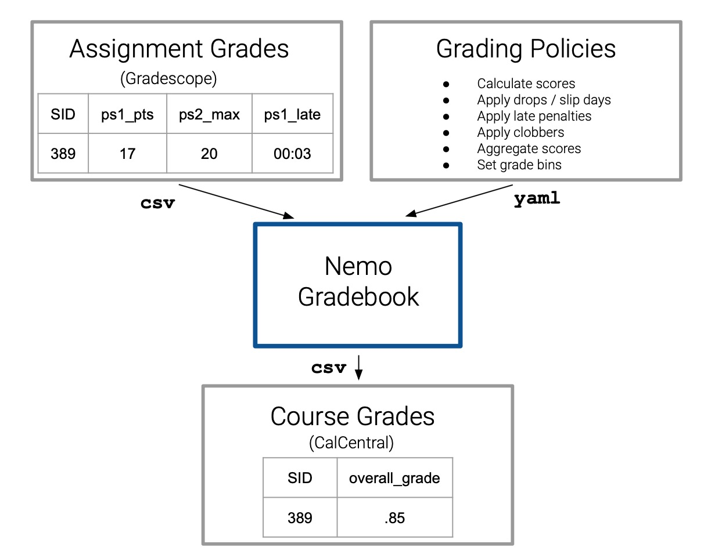

# Summary

`nemogb` (Nemo Gradebook)[@NemoGB-Package] allows for accurate and systematic computations of the final course letter grades. These computations require two inputs: a specifically structured YAML file representing the grading policy from the class syllabus and the assignment grades in CSV (comma-separated value) format from Gradescope [@10.1145/3051457.3051466] or other similar learning management systems, like Canvas [@canvas_gradebook_guide].  The package uses these two inputs to translate any complex grading policy into a composition of nested aggregation computations that can be documented and tested.

# Statement of Need

While the final grade at the end of a course is an elementary part of most college courses, the computations for these grades can be deceptively intricate. This can be particularly challenging in larger STEM classes that accommodate their diverse student body with flexible grading policies such as assignment drop, slip days, and late penalties. Although most classes use slight variations of the same policies, many of the gradebooks found in LMSs cannot sustain these complexities.

In response, many instructors elect to calculate their course grades by writing their own scripts or spreadsheets. These scripts quickly accumulate hundreds of lines of code. More problematically, there is no method to assess accuracy of the final computation.

`nemogb` is an R package that calculates course grades according to a very wide range of policies while guaranteeing accuracy through comprehensive unit-testing. The course-specific grading policies are stored in a structured YAML file that, once written, allows instructors to compute grades at any point in the semester in order to monitor student progress - not just once at the end of the semester. The structure of the package -- and the open-source nature of it -- allows for instructors to contribute functionality that is unique to their course. This R package also functions as the backend of the NemoGB Shiny app [@NemoGB-App], which lets the user create their grading policy file using a point and click interface. 

Grading Workflow WITH NemoGB             |  Grading Workflow WITHOUT NemoGB
:-------------------------:|:-------------------------:
{height="150pt"}  |  {height="150pt"}

# Package Functionality

`nemogb` breaks down the calculation of a course grade into a series of nested aggregations (see figure above). It accommodates the generic policies included in most syllabi: applying lateness penalties, dropping the *n* lowest scores in a category, and using averages or weighted averages to aggregate assignment scores into overarching category scores.

The details of the course grading structure -- usually detailed in the syllabus or on the class website -- can be articulated in YAML format using a series of accepted keys (e.g. `score`, `aggregation`, `lateness`, `drop_n_lowest`, etc.). More direction about creating a policy file is provided in the `Building a Policy File` vignette. The nested structure of this policy file reflects the nested structure of a course grade. The assignment scores come directly from Gradescope or from Canvas in a .csv file. These two files (the YAML policy file and the Gradescope or Canvas assignment data) function as the two inputs for `nemogb`'s primary and overarching function: `get_grades()`.

While `get_grades()` encapsulates the primary functionality of the R package, it is comprised of four sequential functions:

-   `process_gs()` ensures the correct format of the Gradescope or Canvas csv.

-   `process_policy()` similarly ensures the correct format of the policy file.

-   `reconcile_policy_with_gs()` checks the compatibility of the policy file and the Gradescope or Canvas data.

-   `calculate_grades()` computes the course grades and returns the final grade (and the scores for every intermediate category) appended to the original data.

# Classroom Usage

This R package has been used for several semesters at UC Berkeley to calculate course grades in large statistics and data science classes. It has come to replace the error-prone workflow where each instructor writes their own custom, but untested, script or spreadsheet.

# Comparison to Other Packages

Most other commonly-used packages -- particularly R packages -- are used for grading on an assignment-level basis. For example, the `gradeR` package "helps grade your students’s assignment submissions that are R Scripts" [@GradeR] whereas `nemogb` is used for the computations of the final, overall course grade. The software that has the most similar computational purpose as `nemogb` are popular learning-management systems (LMS) used in higher education. This includes Canvas, Moodle [@moodle_grade_calculations], Blackboard Learn [@blackboard_calculate_grades], and D2L Brightspace [@d2l_about_grades], all of which provide an integrated gradebook that allow the instructor to specify the manner in which assessment scores are used to calculate a final course grade. What makes `nemogb` unique is its flexibility and its capacity for instructor collaboration and contribution.

# Story of the Project

As students, we understand the importance of having an informed instructor who understands where we stand in their course. This began as an independent study centered around using R Shiny in order to create a web-based grading tool that allowed for the computation of course grades for diverse grading policies. We wanted to develop a tool that allowed for flexibility in their policies and precision in their computations. This led to the development of this package, which operates as the backend of the NemoGB app but can also be used independently to compute course grades. 

# Acknowledgements

The authors would like to thank lain Carmichael and Calvin Carter for helpful ideas and discussions throughout the development of this project.

As of summer 2024, this project was funded by the an Instructional Technology and Innovation Micro Grant Program through the University of California, Berkeley. 

# References
